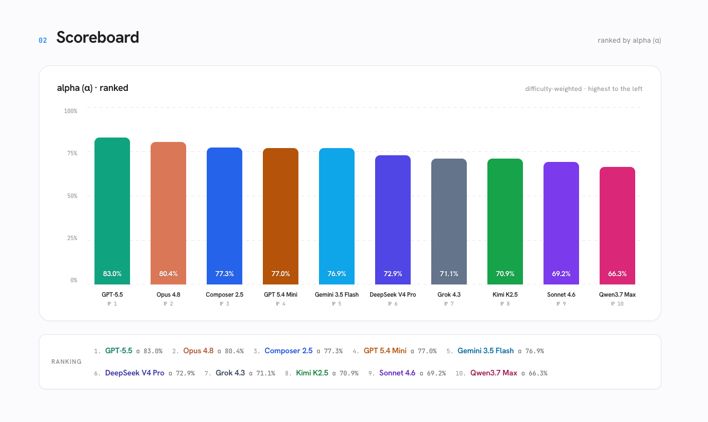
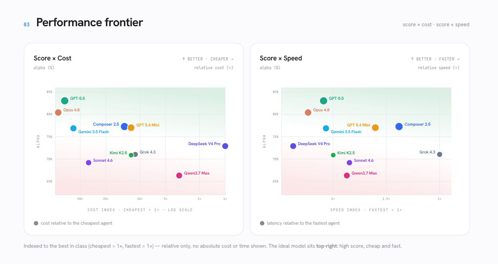

# HEIST

_Hidden Evaluation of Integrated System Tasks._

HEIST is a local benchmark harness for CLI coding agents on hard, multi-file
engineering tasks. It runs an agent in an isolated workspace, grades the result
with a grader the agent never sees, and leaves a full audit trail on disk.

## Why hidden graders

Each task gives the agent a multi-file codebase, a public function contract in
the prompt, and a visible test command. The visible tests are a hint, not the
bar. The real grader lives in `hidden/`, outside the workspace copied into the
sandbox, and runs only after the agent is done.

That split is the point. Ship the grader next to the code and an agent reads it,
writes the minimum that passes, and you've measured test-fitting instead of
engineering. Hidden, the agent has to infer the real contract from the prompt
and visible tests — including the edge cases those tests skip. Tasks are
stateful and cross-file, so a pass means the agent found the contract, not just
the happy path.

Every task ships a `reference/` solution that must score `1.0`, so a low agent
score is the agent's fault, not an unsolvable task.

## What's in this repo

The full harness, the analysis scripts, a published report, and **three example
tasks** with their graders and reference solutions.

The examples show the exact task format and a grader end to end. The 30-task
`frontier` set the harness is built to run is **held out on purpose** — its
prompts, graders, and reference solutions aren't here. Once tasks and graders
are public, scores stop measuring engineering and start measuring exposure to
the answer key. The holdout is the design, not a gap.

## Leaderboard

Ten agents against the 30-task frontier set. The report is one HTML file —
[`results/frontier-2026-06-15/report.html`](results/frontier-2026-06-15/report.html),
open it in any browser. This is a single run, not a standing leaderboard; reruns
on other days and CLI versions will move the numbers.

The main metric is **alpha (α)**, a difficulty-weighted score: hard tasks
count more than easy ones, so a model can't coast on the easy tail.



Score alone hides the tradeoffs, so the report's **performance frontier** plots
alpha against cost and against speed. Both axes are *relative* — indexed to the
best in class (cheapest = 1×, fastest = 1×), with no absolute cost or time shown
— and the ideal model sits top-right: high score, cheap, and fast. DeepSeek V4
Pro is the cheapest of the ten; Grok 4.3 is the fastest on passing tasks.



### How the report stays leak-free

The report only carries per-model alpha and a normalized cost/speed index — no
per-`(agent, task)` rows, no held-out task names, no absolute cost or latency.
Nothing an agent could fit to, nothing that pins the held-out set.
`tests/test_report_leakfree.py` checks the published `report.html` for exactly
those markers, so regenerating it can't reintroduce a leak.

## Quick start

```bash
uv sync --dev
uv run heist suites list
uv run heist tasks list --suite examples
uv run heist agents list
```

Run the three example tasks against one agent (the agent's CLI must be installed
and authenticated):

```bash
uv run heist run --suite examples --agent claude-opus-4.7-high
```

A single task, with a longer timeout:

```bash
uv run heist run \
  --suite examples \
  --task ticket-lifecycle \
  --timeout 900 \
  --agent codex-gpt-5.5-high
```

Every agent against every example task, four jobs in parallel:

```bash
uv run heist run --suite examples --all-agents --jobs 4
```

### Useful flags

- `--dry-run` prints the `(agent, task)` matrix and exits 0.
- `--task-glob "<pat>"` selects tasks by fnmatch over their ids.
- `--provider <name>` / `--all-agents` select agents; `--exclude-agent <id>` drops one.
- `--provider-jobs claude=3,cursor=4,codex=2` caps concurrency per provider.
- `--retry N`, `--fail-fast`, `--exit-on-failure` control failure handling.
- `-v` / `-vv` raise verbosity; `--quiet` / `--no-progress` hide the live UI.

Run `uv run heist agents list` to see the built-in agent registry.

## How runs work

For each `(agent, task)` pair, HEIST:

1. copies `tasks/<suite>/<task-id>/workspace/` into a fresh run directory
2. initializes a baseline git commit
3. renders the task prompt and invokes the configured agent CLI
4. captures stdout, stderr, transcript, usage, latency, reported cost
5. writes the agent's diff against the baseline
6. runs `hidden/grader.py` against the final workspace
7. appends one row to `results.jsonl` and refreshes the report

Hidden graders return strict JSON:

```json
{"score": 0.0, "passed": false, "checks": [{"name": "edge", "passed": false, "message": ""}]}
```

`success` is true only when `score >= 0.999`. The raw score is preserved as
`partial_credit`.

Runs land under `runs/<run-id>/` (git-ignored — raw output holds hidden graders,
transcripts, and diffs that would leak the test set):

```text
runs/<run-id>/
  manifest.json
  results.jsonl
  summary.md
  workspaces/<agent>/<task>/
  artifacts/<agent>/<task>/{stdout.txt,stderr.txt,diff.patch,grader.json}
```

Re-render or re-grade an existing run, or export it to the eval-audit Parquet
format:

```bash
uv run heist report --run runs/<run-id>
uv run heist grade  --run runs/<run-id>
uv run heist export eval-audit --run runs/<run-id>
```

### Cost-free replay

`heist runs replay <source>` re-grades and re-reports a prior live run without
invoking an agent CLI — it reuses the captured stdout, final workspace, and
usage. Use it to iterate on grader or reporting code without spending on any
API:

```bash
uv run heist runs replay runs/<run-id>
```

Replay is below the CLI, not below the network: it does not re-test the agent
prompt, environment, or model behaviour — those need a live run.

### Cross-run analysis

Every run records a `harness_git_sha`, so regressions can be tied back to
harness changes.

```bash
uv run heist runs list                       # all runs, newest first
uv run heist runs compare run-a run-b        # score / cost / latency Δ
uv run heist runs history --agent <id> --task <id>
```

`compare` accepts run ids, named baselines (`runs/baselines.json`), and
`latest` / `previous`, and flags score drops over 10pp and previously-passing
tasks that now fail.

## Task contract

Each task lives under `tasks/<suite>/<task-id>/`:

```text
task.yaml      # id, title, category, prompt, visible command, optional timeout
workspace/     # copied into the agent-visible sandbox
hidden/        # grader code; never copied into the workspace
reference/     # known-good files used by tests to prove the grader is solvable
```

`task.yaml` is validated by Pydantic and forbids extra fields. The default
visible test command is `python -m pytest -q`. The prompt defines the public
contract and expected return shape; the grader tests that contract, including
the cases the visible tests skip.

The three tasks under [`tasks/examples/`](tasks/examples/) are the worked
reference for this layout — read one task end to end (`task.yaml`, the seed
`workspace/`, `hidden/grader.py`, and `reference/`) before authoring your own.

### Add your own task

1. Create `tasks/<suite>/<your-task-id>/` (a new suite is just a new directory
   under `tasks/`). The directory name must equal the `id` in `task.yaml`.
2. Write `task.yaml` with the prompt and public return-shape contract.
3. Put the starting code in `workspace/` and a visible test under
   `workspace/tests/`. The seed must pass its visible tests but must **not**
   fully satisfy the hidden grader — that gap is the task.
4. Write `hidden/grader.py` to emit the strict JSON above. Graders must not
   touch the network or local secrets, and must fail loudly on malformed output
   rather than award accidental partial credit. The examples share a
   `grader_safety.py` helper for tolerating malformed agent return values
   without crashing the grader.
5. Put a known-good solution in `reference/`.
6. Verify with the same guard the suite uses:

```bash
uv run pytest tests/test_tasks.py
uv run heist tasks list --suite <suite>
```

`tests/test_tasks.py` enforces the two invariants that keep a task honest: the
`reference/` solution scores `1.0`, and the seed `workspace/` scores at most
`0.7`.

## Custom agents

Built-in agents live in `src/heist/agents.py`. Add agents for a run with a YAML
file:

```yaml
agents:
  my-agent:
    label: My Agent
    provider: local
    model_id: my-model
    command: ["my-agent-cli", "run", "{prompt}"]
    prompt_via_stdin: false
    required_env: []
    env_overrides: {}
```

```bash
uv run heist run --suite examples --agent-file agents.yaml --agent my-agent
```

Use `{prompt}` when the CLI takes the prompt as an argument; set
`prompt_via_stdin: true` when it reads from stdin.

## Configuration

`heist.toml` at the repo root sets defaults. Precedence: CLI flags > `HEIST_*`
env vars > `heist.toml` > `[tool.heist]` in `pyproject.toml`.

```bash
uv run heist config init      # write a starter heist.toml
uv run heist config show      # print the effective merged config
uv run heist config path      # show which sources were loaded
```

```toml
# heist.toml
[defaults]
suite           = "examples"
jobs            = 8
timeout_s       = 300
output_dir      = "runs"
progress        = true
exit_on_failure = false

[providers]
claude = 3
codex  = 2
cursor = 4

[selection]
default_agents = ["claude-opus-4.7-high", "codex-gpt-5.5-high", "cursor-composer-2"]
```

Environment overrides use the same names with a `HEIST_` prefix, e.g.
`HEIST_JOBS=4`, `HEIST_PROGRESS=false`, `HEIST_PROVIDER_CLAUDE=2`. Booleans must
be `true/false`, `yes/no`, `on/off`, or `1/0`; jobs, timeouts, and provider caps
must be at least `1`.

## Development

```bash
uv sync --dev
uv run pre-commit install
make check          # ruff check + format check + pytest
```

Keep benchmark changes boring:

- don't hand-edit generated run artifacts (`runs/` is generated output)
- don't let hidden graders touch the network or local secrets
- keep grader failures loud — invalid JSON, skipped checks, and swallowed errors
  must fail the task, not look like partial success
- after renaming a task or module, grep the whole repo for the old path

## License

MIT — see [LICENSE](LICENSE).
