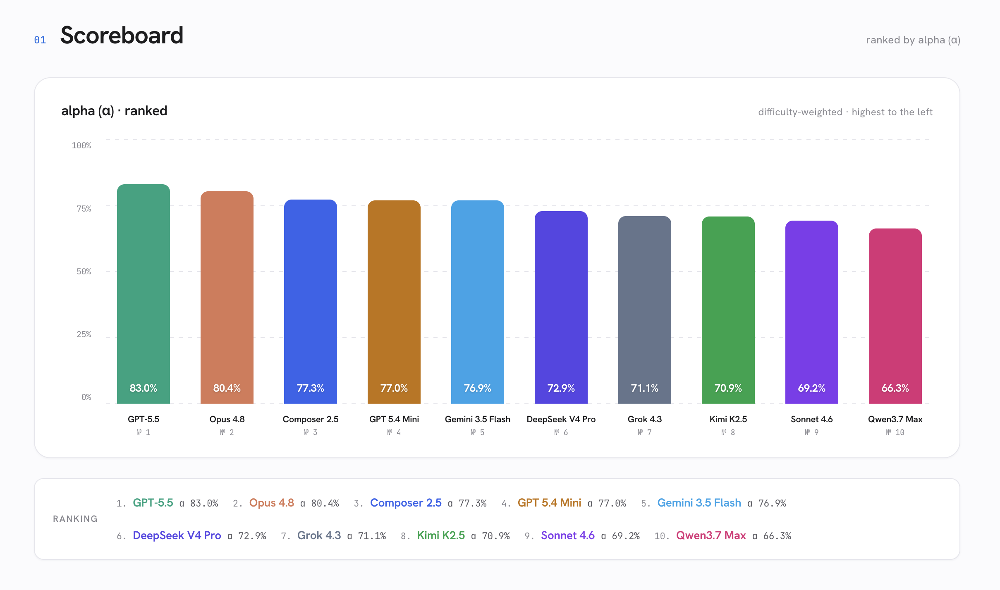
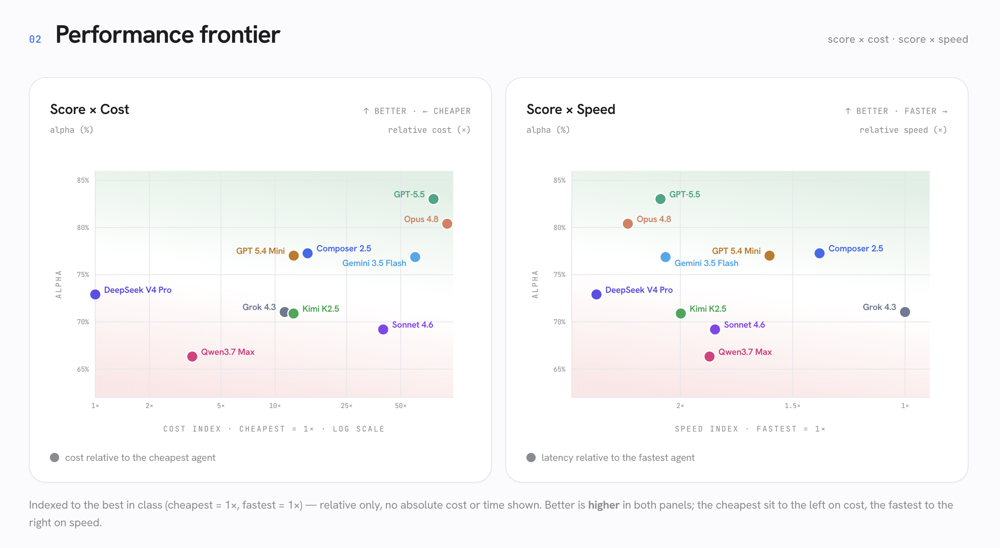

# HEIST

HEIST is a local benchmark harness for CLI coding agents on multi-file
engineering tasks. It runs an agent in an isolated workspace, grades the result
with code the agent never sees, and keeps the run artifacts on disk for review.

## Why Hidden Graders

Each task includes a prompt, a starter workspace, and a visible test command.
Those visible tests are only a sanity check. The real grader lives in `hidden/`,
outside the workspace copied into the run sandbox, and runs after the agent is
done.

That split matters. If the grader is public, a run can reward fitting the test
instead of solving the task. With a hidden grader, the agent has to follow the
contract in the prompt and handle cases the visible tests do not cover. Each
task also has a `reference/` solution that must score `1.0`, so a low score
means the agent missed the contract, not that the task is unsolvable.

## What's Public

This repo contains the harness, analysis scripts, a leak-safe report, and
**three example tasks** with their graders and reference solutions.

The examples show the task format end to end. The 30-task `frontier` set used
for the published report is **held out on purpose**: its prompts, graders, and
reference solutions are not in this repo. Once those files are public, future
scores can reflect exposure to the answer key instead of task performance.

## Leaderboard

The published report compares ten agents on the held-out 30-task frontier set:
[`results/frontier-2026-06-15/report.html`](results/frontier-2026-06-15/report.html).
Open it in any browser. This is one run, not a standing leaderboard; different
dates, CLIs, and model versions can move the numbers.

The main score is **alpha (α)**, a difficulty-weighted score where harder tasks
count more than easier ones.



The report also plots alpha against relative cost and speed. Cost and speed are
indexed to the best result in the run, so the report shows tradeoffs without
publishing absolute spend, latency, task names, or per-task rows.



`tests/test_report_leakfree.py` checks that the published report does not expose
held-out task details.

## Quick Start

```bash
uv sync --dev
uv run heist suites list
uv run heist tasks list --suite examples
uv run heist agents list
```

Run the three public example tasks against one installed and authenticated
agent:

```bash
uv run heist run --suite examples --agent claude-opus-4.8-xhigh
```

The default per-task timeout is 30 minutes. Override it with `--timeout`
(seconds) when a run needs a different cap:

```bash
uv run heist run \
  --suite examples \
  --task ticket-lifecycle \
  --timeout 1200 \
  --agent claude-opus-4.8-xhigh
```

Preview a run without invoking an agent:

```bash
uv run heist run --suite examples --all-agents --dry-run
```

Useful selection flags:

- `--task <id>` or `--task-glob "<pat>"` select tasks.
- `--agent <id>`, `--provider <name>`, and `--all-agents` select agents.
- `--exclude-agent <id>` drops one agent from a larger selection.
- `--jobs N` and `--provider-jobs claude=3,codex=2` cap concurrency.
- `--retry N`, `--fail-fast`, and `--exit-on-failure` control failures.

## How Runs Work

For each `(agent, task)` pair, HEIST copies
`tasks/<suite>/<task-id>/workspace/` into a fresh run directory, commits that
baseline, invokes the configured agent CLI, records the final diff and logs,
runs `hidden/grader.py`, and appends a row to `results.jsonl`.

Hidden graders return strict JSON:

```json
{"score": 0.0, "passed": false, "checks": [{"name": "edge", "passed": false, "message": ""}]}
```

`success` is true when `score >= 0.999`; the raw score is kept as
`partial_credit`.

Runs land under `runs/<run-id>/`, which is git-ignored because raw run output can
contain hidden graders, transcripts, and diffs:

```text
runs/<run-id>/
  manifest.json
  results.jsonl
  summary.md
  workspaces/<agent>/<task>/
  artifacts/<agent>/<task>/{stdout.txt,stderr.txt,diff.patch,grader.json}
```

Re-render, re-grade, or export an existing run:

```bash
uv run heist report --run runs/<run-id>
uv run heist grade  --run runs/<run-id>
uv run heist export eval-audit --run runs/<run-id>
```

Replay re-grades a previous live run without invoking an agent CLI:

```bash
uv run heist runs replay runs/<run-id>
```

Compare past runs:

```bash
uv run heist runs list
uv run heist runs compare run-a run-b
uv run heist runs history --agent <id> --task <id>
```

## Task Format

Each task lives under `tasks/<suite>/<task-id>/`:

```text
task.yaml      # id, title, category, prompt, visible command, optional timeout
workspace/     # copied into the agent-visible sandbox
hidden/        # grader code; never copied into the workspace
reference/     # known-good files used by tests to prove the grader is solvable
```

`task.yaml` is validated by Pydantic and forbids extra fields. The default
visible command is `python -m pytest -q`. The prompt defines the public contract;
the grader checks that contract, including cases the visible tests skip.

The three tasks under [`tasks/examples/`](tasks/examples/) are the public
examples. Read one task end to end before adding your own.

To add a task:

1. Create `tasks/<suite>/<your-task-id>/`; the directory name must match the
   `id` in `task.yaml`.
2. Write `task.yaml` with the prompt and public return shape.
3. Put starting code and visible tests in `workspace/`.
4. Write `hidden/grader.py` to emit the strict JSON above. Graders must not
   touch the network or local secrets, and malformed output should fail loudly.
5. Put a known-good solution in `reference/`.
6. Check the task:

```bash
uv run pytest tests/test_tasks.py
uv run heist tasks list --suite <suite>
```

`tests/test_tasks.py` verifies that each `reference/` solution scores `1.0` and
each seed `workspace/` scores at most `0.7`.

## Custom Agents

Built-in agents live in `src/heist/agents.py`. Add local agents with a YAML
file:

```yaml
agents:
  my-agent:
    label: My Agent
    provider: local
    model_id: my-model
    command: ["my-agent-cli", "run", "{prompt}"]
    prompt_via_stdin: false
    required_env: []
    env_overrides: {}
```

```bash
uv run heist run --suite examples --agent-file agents.yaml --agent my-agent
```

Use `{prompt}` when the CLI takes the prompt as an argument; set
`prompt_via_stdin: true` when it reads from stdin.

## Configuration

`heist.toml` sets defaults. Precedence is CLI flags, then `HEIST_*` environment
variables, then `heist.toml`, then `[tool.heist]` in `pyproject.toml`.

```bash
uv run heist config init
uv run heist config show
uv run heist config path
```

Environment overrides use the same names with a `HEIST_` prefix, such as
`HEIST_TIMEOUT_S=1200`, `HEIST_JOBS=4`, `HEIST_PROGRESS=false`, or
`HEIST_PROVIDER_CLAUDE=2`.

## Development

```bash
uv sync --dev
uv run pre-commit install
make check
```

Keep benchmark changes boring:

- do not edit generated run artifacts in `runs/`
- do not let hidden graders touch the network or local secrets
- keep grader failures loud
- after renaming a task or module, grep the repo for the old path

## License

MIT — see [LICENSE](LICENSE).
